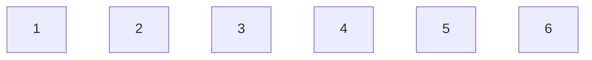

* content
{:toc}

## 目的

```
程序 = 数据结构 + 算法
```

了解数据结构、算法思想、优缺点、合理运用到项目中，
常见算法：

## 一、数据结构

了解各类数据结构在内存的存储模型。

### 1. 数组



    连续分配的存储区域（连续的内存空间）
    
    如果没有足够连续分配的存储空间，则不能够成功常见数组对象。
    
    特性：随机查找速度快 O(1),插入效率低O（n)  --> Why？  移动个数

### 2. 链表(单/双/循环链)

#### 2.1 单项链表

```
 data|next  ->   data|next ->  data|next
```

    可以是非连续的存储区域（了解3类链表特点）
    
    特性：顺序查找 O(n),插入、删除 O（1) 删除前需要查找  -->Why？ 移动个数
    
    扩展：实例：点餐服务 ------> 插入、删除效率高

#### 2.2 循环链 [约瑟夫问题](https://baike.baidu.com/item/%E7%BA%A6%E7%91%9F%E5%A4%AB%E9%97%AE%E9%A2%98/3857719)

>  尾节点的 next 指向 第一个节点。

#### 2.3 双向链表 

> 指定节点： 删除O(1) （空间、时间互换）  

> pre| data | next -> pre|data|next -> pre|data|next  

#### 2.4 [翻转链表](https://leetcode.com/problems/reverse-linked-list-ii/)

>  1 -> 2 -> 3 ->4    =>   4->3->2->1

```java
//理解 current.next = prev;   current节点指向prev; 即当前current: 2 -> 1  (如果current:2  prev:1) 
// pre = current;   当前的current的位置保存的是pre。2->1
class solution{
    public ListNode reverseNode(ListNode head)
    {
        if(head == null || head.next == null)
        {
            return head;
        }
        
        ListNode pre = head;
        ListNode current = head.next;
        pre.next = null; //pre 只表示一个节点
   
        //翻转模板1   （pre、current、next 3节点)
        while(current !=null)
        {
        	ListNode next = current.next;
            current.next = pre;
            pre = current; //包含所有节点
            current = next;
        }
        return pre;        
    }    
}
// https://leetcode.com/problems/reverse-linked-list/
// 了解如何遍历链表、各节点内容
```

- 1 -> 2 -> 3->4 -> 5   =>  1-> 4->3->2->5

  

```java
// 哨兵节点
class solution{
    public ListNode reverseNode(ListNode head,int left, int right)
    {
        //校验
        if(head == null ||left >=right)
        {
            return head;
        }
        //哨兵节点，便于节点找到该节点并返回
        ListNode dummy = new ListNode(-1);
        dummy.next = head; //dummy 表示最新节点
        head = dummy;//都是最新值
        
        //保留之前
        for(int i =1 ;i<left;i++)
        {
            head = head.next;
        }      
        
        //保留之前节点变量
        ListNode pre =head;
        //保留m 起始点，便于指向后面未翻转的节点
        ListNode mNode = head.next;
        ListNode nNode = mNode;//翻转 n节点变量 2->3->4->5
		ListNode postN = nNode.next; //当前节点： 2-> 3
        for(int i=left;i<right;i++)
        {
            ListNode next = postN.next;// next 节点
			postN.next = nNode; //翻转后:  3-> 2 ->3 ...
            nNode = postN;//当前n节点
			postN = next;//遍历：下一节点           4
        }
        
        //2节点指向最后未翻转节点
        mNode.next =postN;
        pre.next = nNode;
        
        return dummy.next;   
    }
}
```

#### 2.5 [深度拷贝带随机指针的链表](https://leetcode-cn.com/problems/copy-list-with-random-pointer)


```java
/*
// Definition for a Node.
class Node {
    int val;
    Node next;
    Node random;

    public Node(int val) {
        this.val = val;
        this.next = null;
        this.random = null;
    }
}
*/
//了解多节点链表
```

- 基于 HashMap 实现 映射关系

```java
//https://leetcode-cn.com/problems/copy-list-with-random-pointer
 public Node copyRandomList(Node head) {
     if(head == null) {
         return null;
     }
     Map<Node, Node> map = new HashMap<Node, Node>();
     Node newHead = head;
     while (newHead != null) {
         if (!map.containsKey(newHead)) {
             Node node = new Node(newHead.val);
             map.put(newHead, node);
         }
         if (newHead.random != null) {
             Node random = newHead.random;
             if (!map.containsKey(random)) {
                 Node copyRandom = new Node(random.val);
                 map.put(random, copyRandom);
             }
             map.get(newHead).random = map.get(random);
         }
         newHead = newHead.next;
     }
     newHead = head;
     while (newHead != null) {
         Node next = newHead.next;
         map.get(newHead).next = map.get(next);
         newHead = newHead.next;
     }
     return map.get(head);
 }
```

- 基于链表本身实现

```java
class Solution {
    public Node copyRandomList(Node head) {
        if (head == null) {
            return null;
        }
        copy(head);
        copyRandom(head);
        return split(head);
    }
    public void copy(Node head) {
        Node node = head;
        while(node != null) {
            Node copy = new Node(node.val);
            copy.next = node.next;
            node.next = copy;
            node = copy.next;
        }
    }
    
    public void copyRandom(Node head) {
        Node node = head;
        while(node != null && node.next != null) {
            if (node.random != null) {
                node.next.random = node.random.next;
            }
            node = node.next.next;
        }
    }
    
    public Node split(Node head) {
        Node result = head.next;
        Node move = head.next;
        while(head != null && head.next != null) {
            head.next = head.next.next;
            head = head.next;
            if (move != null && move.next != null) {
                move.next = move.next.next;
                move = move.next;
            }
        }
        return result;
    }
}
```

#### 2.6 [两个链表相加](https://leetcode.com/problems/add-two-numbers/)


```java
//考虑问题要全面（多种情况）
// 1. 长度不等  2.进位  3.除法 与 取模 
/**
 * Definition for singly-linked list.
 * public class ListNode {
 *     int val;
 *     ListNode next;
 *     ListNode() {}
 *     ListNode(int val) { this.val = val; }
 *     ListNode(int val, ListNode next) { this.val = val; this.next = next; }
 * }
 */
class Solution {
    
    public ListNode addTwoNumbers(ListNode l1, ListNode l2) {
        if (l1 == null) {
            return l2;
        }
        if (l2 == null) {
            return l1;
        }
        int carry = 0;
        ListNode head = new ListNode(-1);
        ListNode pre = head;
        while (l1 != null && l2 != null) {
            int number = l1.val + l2.val + carry;
            carry = number / 10;
            ListNode node = new ListNode(number % 10);
            pre.next = node;
            pre = pre.next;
            l1 = l1.next;
            l2 = l2.next;
        }
        while (l1 != null) {
            int number = l1.val + carry;
            carry = number / 10;
            ListNode node = new ListNode(number % 10);
            pre.next = node;
            pre = pre.next;
            l1 = l1.next;
        }
        while (l2 != null) {
            int number = l2.val + carry;
            carry = number / 10;
            ListNode node = new ListNode(number % 10);
            pre.next = node;
            pre = pre.next;
            l2 = l2.next;
        }
        if (carry != 0) {
            ListNode node = new ListNode(carry);
            pre.next = node;
        }
        return head.next;
    }
}

```

#### 2.7 [LRU Cache](https://leetcode.com/problems/lru-cache/)

> 最少使用被淘汰算法： 基于双向链表（便于查找上一个节点和下一个节点），HashMap作为缓存；
>
> 将最新的数据放在尾节点，达到最大值时，如果要插入数据，则移除头结点数据并重新指向头结点，然后插入尾结点数据。（也可将最新数据插入头结点，删除尾结点）


```java
/**
 * Your LRUCache object will be instantiated and called as such:
 * LRUCache obj = new LRUCache(capacity);
 * int param_1 = obj.get(key);
 * obj.put(key,value);
 */
class LRUCache {
    private class CacheNode {
        CacheNode prev;
        CacheNode next;
        int key;
        int value;
        public CacheNode(int key, int value) {
            this.key = key;
            this.value = value;
            this.prev = null;
            this.next = null;
        }
    }
     
    private int capacity;
    private Map<Integer, CacheNode> valNodeMap = new HashMap();
    //自定义头结点、尾结点（哨兵结点，便于新增和删除很少使用的结点）
    private CacheNode head = new CacheNode(-1, -1);
    private CacheNode tail = new CacheNode(-1, -1);
 
    public LRUCache(int capacity) {
        this.capacity = capacity;
        tail.prev = head;
        head.next = tail;
    }
     
    public int get(int key) {
        if (!valNodeMap.containsKey(key)) {
            return -1;
        }
        CacheNode current = valNodeMap.get(key);
        current.prev.next = current.next;
        current.next.prev = current.prev;
        moveToTail(current);
        return valNodeMap.get(key).value;
    }
     
    public void put(int key, int value) {
        if (get(key) != -1) {
            valNodeMap.get(key).value = value;
            return;
        }
         
        if (valNodeMap.size() == capacity) {
            valNodeMap.remove(head.next.key);
            head.next = head.next.next;
            head.next.prev = head;
        }
     
        CacheNode insert = new CacheNode(key, value);
        valNodeMap.put(key, insert);
        moveToTail(insert);
    }
     
    private void moveToTail(CacheNode current) {
        current.prev = tail.prev;
        tail.prev = current;
        current.prev.next = current;
        current.next = tail;
    }
}
```

### 参考

<<算法图解>>

- ”程序员小灰“ 公众号 (推荐)

[约瑟夫问题](https://baike.baidu.com/item/%E7%BA%A6%E7%91%9F%E5%A4%AB%E9%97%AE%E9%A2%98/3857719)

- 网课（腾讯课堂）
